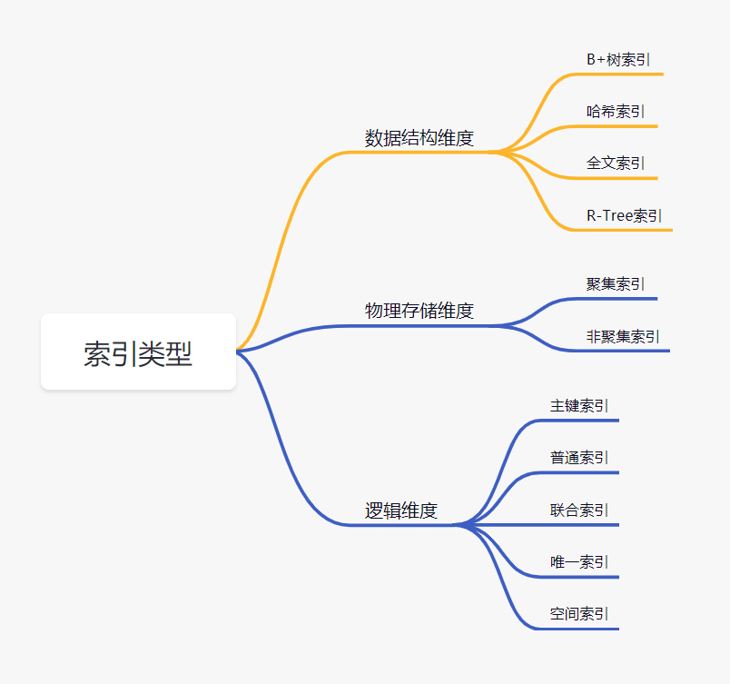

# Database

## 关系型与非关系型

|           | Relational                  | Non                             |
| --------- | --------------------------- | ------------------------------- |
| 数据模型和存储方式 | 结构化，以表格形式组织存储，行列组成          | 多种数据存储类型，如键值对、文档（json-like）、图形等 |
| 查询语言      | SQL，支持复杂查询                  | 更加灵活，如MongoDB和ES中的基于json的查询语言   |
| 适用场景      | 需要强一致性、严格数据结构和事务处理的场景，如金融系统 | 高并发、动态数据模型，如社交网络、实时数据处理等        |

## MySQL

### 事务隔离级别 (隔离性依次增强，性能变差)

* read uncommitted: 事务可以读取其他事务尚未提交的数据。可能出现dirty read
* read committed: 只能读取已经提交的数据。避免脏读，可能出现unrepeatable read, e.g. 事务A首先读取了某个数据的值，事务B对该数据进行了修改并提交，事务A再次读取数据不一致，可能导致逻辑错误。
* repeatable read: 即使其他事务对数据进行了修改，先读取的事务也不会受到影响，它读取的仍然是最初创建的快照中的版本。通常针对数据UPDATE操作。可能出现幻读，因为对数据行的插入或删除操作，没有提供一致的快照。
* serializable: 事务之间没有并发。避免了脏读、不可重复读、幻读，但带来了性能损失。

### 主从复制

<figure><figcaption></figcaption></figure>

* master: 对数据库执行更改的所有操作记录在binlog中
* slave:
  * io thread: 读取binlog内容并写进自己的relay log中
  * sql thread: 执行relay log中的语句

### 索引数据结构

B-/+ tree reading [https://mp.weixin.qq.com/s/RWkc2lNarKnn8Dc0HrP58g](https://mp.weixin.qq.com/s/RWkc2lNarKnn8Dc0HrP58g)

### 索引类型

<figure><figcaption></figcaption></figure>

| 索引类型    | 描述                                                           |
| ------- | ------------------------------------------------------------ |
| B+树索引   | 只有叶子节点存储数据，有序排列且用链表相连，树更矮更胖，查询效率更高，磁盘I/O次数更少。                |
| 哈希索引    | 索引列值映射到索引表中存储了对应数据行的物理地址的位置。适用于等值查询，不支持范围查询和排序操作。            |
| 聚集/聚簇索引 | 决定了数据行在磁盘上的物理排序方式/存储顺序，所以一个表只能有一个聚集索引，一般就是主键索引。叶子节点包含完整的数据行。 |
| 非聚集索引   | 存放的是索引并指向存储在其他位置的数据行。叶子节点包含索引列的值和指向数据行的指针。                   |
| 覆盖索引    | 包含了查询所需的所有列，不需要回表获取数据。                                       |
| 主键索引    | 基于主键列，用于保证表中每一行的唯一标识。                                        |
| 唯一索引    | 保证索引列中的值唯一，不允许重复值的存在。                                        |
| 外键索引    | 基于外键列，用于维护表之间的引用完整性。                                         |
| 全文索引    | 用于对文本数据进行全文搜索，支持关键词搜索、模糊搜索和语义搜索等功能。                          |

### 索引下推

把额外的过滤条件下推到索引扫描阶段，减少回表和需要读取的数据量。

### InnoDB

| 5种表级锁    |                                                         | 4种行级锁               |                                    |
| -------- | ------------------------------------------------------- | ------------------- | ---------------------------------- |
| 意向读锁     | 优化技术，表明自己的意向是读取数据，用于提供给其他事务或线程关于锁的状态的信息。提高并发性能和减少锁冲突开销。 | 记录锁                 | 针对索引记录的行级锁                         |
| 意向写锁     |                                                         | 间隙锁                 | 锁定索引键之间的区域，防止其它事务在范围内插入数据。         |
| 读锁       |                                                         | Next-Key锁           | 记录锁+间隙锁                            |
| 写锁       |                                                         | InsertIntentionLock | 允许多个事务在并发插入数据时共享表级锁，不需要每个事务都获取行级锁。 |
| AUTO-INC | 保证自增字段的唯一性和顺序性                                          |                     |                                    |

