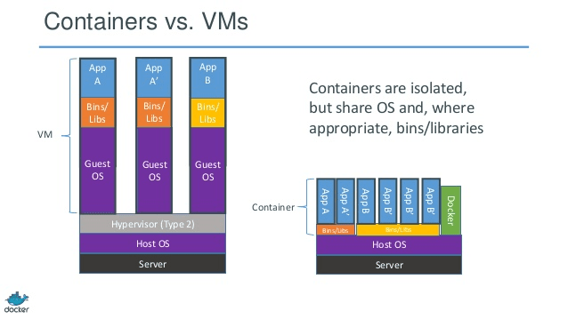

# Docker & k8s

## Docker

### vs VM

<figure><figcaption></figcaption></figure>

| Container                                                   | VM                                                              |
| ----------------------------------------------------------- | --------------------------------------------------------------- |
| os-level virtualization                                     | hardware-level virtualization                                   |
| share hardware resources, e.g. CPU, mem and storage         | has its own virtual hardware resources, allocated by hypervisor |
| faster startup/second-level time                            | slower as need to boot an entire os                             |
| isolated process with its own namespace and resource limits | stronger isolation and better security                          |

### 组成部分

Docker client, daemon, image, container

### Dockerfile

* base image（FROM）
* MAINTAINER信息
* 镜像操作指令（RUN）
* 容器启动时执行的指令（CMD or ENTRYPOINT）

### 容器怎么实现隔离

namespaces and cgroups来实现资源隔离和资源限制（控制容器内进程对系统资源的消耗）。

### 分层

一个完整的镜像可拆分为多个只读层，每个层代表一个修改的增量。UnionFS支持将多个文件系统合并为一个联合文件系统，通过在镜像的每个层上创建UnionFS的branch，实现多层的联合视图。

copy-on-write这一策略用于在修改镜像时，先创建一个独立的写入层，不会影响到原始的只读层。这样只有被修改的文件的副本会被创建，其他文件仍共享相同的只读层，减少了存储空间，提高了容器启动和文件操作的性能。

### network model

* host network: the container share the same network namespace with the host. 容器之间需要通过主机转发才能通信。
* bridge: 在每个节点创建一个默认的网桥 (docker0), 每个容器分配一个独立的虚拟网卡并连接到这个王桥上，网桥负责转发数据包，这使得容器可以与同一主机上的其他容器或主机之间进行网络通信。
* overlay: 用SDN创建虚拟网络层；应用更广泛，提供了更大的灵活性和可扩展性，可通过VXLAN或者IP-in-IP封装方法实现，核心思想都是在原始数据包上添加额外的头部信息。
* link: 在每个容器中创建一个虚拟网络接口

## k8s

<figure><figcaption>
架构组成
</figcaption></figure>

* master主节点：expose api，调度部署和节点管理
  * etcd: 保存所有集群数据的数据库
  * apiserver: expose api, the bridge between the client and k8s cluster
  * controller-manager: 负责维护群集的状态，比如故障检测、自动扩展、滚动更新等
  * scheduler: 让pod在合适的节点上创建运行，资源调度
* 计算节点：真正工作的节点
  * pod: smallest unit in k8s and can run multiple containers（豌豆夹和豌豆）
  * kubelet: node的代理，维护容器的生命周期
  * kube-proxy: node的网络代理，负责为service提供负载均衡将请求转发到pod上

### More Kubelet

* node management: interact with api-server abt the node status
* pod management: create, update or delete a pod
* container health check: startup, liveness (container run), readiness (handle traffic) probes
* resource monitor: get node & pod's data by Metrics Server

### DaemonSet资源对象

会在每个k8s集群中的节点上运行，并且每个节点只能运行一个pod。一般使用场景：每个节点的日志收集和监控运行状态。

### Service资源对象

给相同的多个pod提供固定的统一访问接口，用于服务发现和访问。load balancing, i.e. distribute network traffic across the pods that belong to the service.

### 创建pod过程

1. client -pod配置-> apiserver
2. apiserver -> controller mgr
3. controller mgr -> apiserver -> pod配置 -> etcd
4. scheduler -> 选择适合pod资源配置要求的节点 -pod资源配置单-> node的kubelet
5. kubelet -pod运行信息-> scheduler -> etcd

### 如何访问集群内的pod

Nodeport which means k8s will listen to a fixed port in all the nodes and forward the traffic to the target port of pods/service, others like Ingress and ExternalIP.

## k8s cluster-api

provides declarative lifecycle management for k8s clusters, aka k8s for k8s

* provider: interact with underlying IaaS, e.g. CAPA, CAPZ and CAPV
* management cluster: where cluster api components are installed, CRDs and controllers
* workload cluster

