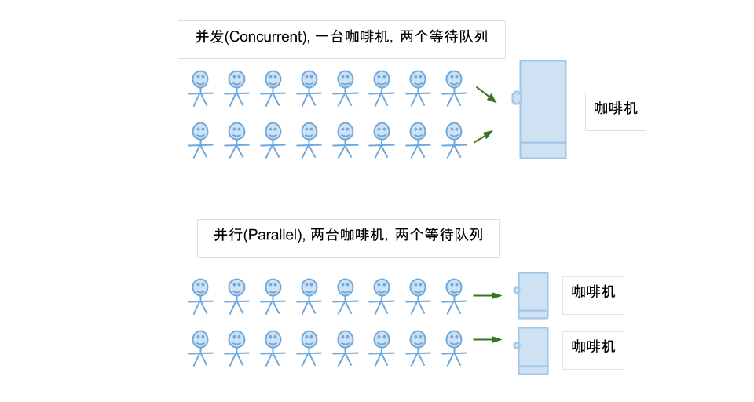

# 并发

<figure><figcaption><p>并发并行</p></figcaption></figure>

### Process Thread Coroutine


* 一个进程可以拥有一个或者多个线程，线程只存在于一个进程里。
* 进程有自己的地址空间，占据独立内存，资源共享复杂，切换开销大，同步简单；线程间资源共享容易，同步需要加锁。
* 协程是一种用户态的轻量级线程，保留上一次调用状态，无需上下文切换开销。
* 线程协程适合IO密集型应用，多进程适合CPU计算密集型应用以利用多核。

### 乐观锁和悲观锁

* 乐观锁：不上锁，更新时检查数据是否被修改过，修改过则放弃操作
  * Compare And Swap(CAS)：VAB，如果内存位置V的值等于预期值A，则位置更新为新值B，否则不执行操作，自旋（重试至成功）；限制：单个变量原子性，ABA问题（即修改为原来的数据，栈顶问题，可加版本号解决）
  * 版本号：修改version++，更新时version?=读取时version
* 悲观锁：总加锁，block其他线程

适用于不同场景，如乐观锁适合多读应用类型以提高吞吐量，避免使用于并发冲突概率高的场景下一直重试导致CPU开销较大



### volatile作用

* 保证可见行：读取前从主内存中刷新，写入后立即同步回主内存。
* 防止指令重排
* 不保证原子性：不会进行加锁操作，e.g. 两个线程各自执行count++，可能导致最终count结果为1，不是预期的2

### 线程间通信协作方式

* volatile
* wait/notify
* join
* ThreadLocal: e.g. 主线程threadLocal.set, 子线程threadLocal.get

### 进程间通信

* 管道
* 信号
* 消息队列
* 共享内存
* 内存映射
* socket

### synchronized vs ReentrantLock

| synchronized                              | ReentrantLock                                       |
| ----------------------------------------- | --------------------------------------------------- |
| implicit lock                             | explicit lock, i.e. need lock and unlock manually   |
| 等待锁时不可中断                                  | 可通过lockInterruptibly()在等待获取锁时，响应中断，i.e. interrupt() |
| unfair lock (线程饥饿)                        | unfair lock by default, fair lock by constructor    |
| less flexible as language-level construct | more flexible, e.g. Condition variables             |

### synchronized底层实现

JVM会找到对象的monitor，如果成功加锁就称为该monitor的唯一持有者，monitor在被释放前不能再被其它线程获取。

synchronized在编译后会产生monitorenter和monitorexit字节码指令，并需要一个引用类型的参数指明要锁定和解锁的对象，i.e.

* 同步实例方法：实例对象
* 同步静态方法：Class对象
* 同步方法块：括号里的对象

### 锁的可重入性

线程可以进入任何一个它已经拥有的锁所同步着（同一个管程对象上）的代码块。synchronized同步块是可重入的。

### CountDownLatch vs CyclicBarrier

* CDL: 计数器，可以调整线程之间的执行顺序，不可重用

```java
CountDownLatch down = new CountDownLatch(1);
down.await();        // 线程挂起，等待count值为0时才继续执行
down.countDown();    // count - 1
down.getCount();
```

* CB: 允许多个线程相互等待，等达到一个共同点后再继续执行，e.g. 计算数据最后合并计算结果。reset后可以重用。

### Semaphore

控制并发数，通过acquire()获得一个许可（acquire阻塞，tryAcquire非阻塞，立即得到执行结果），如果没有就等待，而release()释放一个许可。

```java
public Semaphore(int permits) {
    //参数permits表示许可数目，即同时可以允许多少线程进行访问
    sync = new NonfairSync(permits);
}

public Semaphore(int permits, boolean fair) {    
    //这个多了一个参数fair表示是否是公平的，即等待时间越久的越先获取许可    
    sync = (fair) ? new FairSync(permits) : new NonfairSync(permits);
}
```

### 银行家算法

要求进程在申请资源之前必须先声明它所需要的最大资源数，需要进程请求资源时，检查请求是否<=系统当前可用的资源数，并模拟分配资源给进程，通过安全性算法检查系统是否仍然处于安全状态，如果不安全，分配将被推迟。

### 如何尽量避免死锁

* 减小锁范围
* 按一定顺序申请锁
* 非阻塞锁，e.g. tryLock()

### 产生死锁

```java
import java.util.concurrent.locks.ReentrantLock;

class DeadLock {
	private static ReentrantLock lock1 = new ReentrantLock();
	private static ReentrantLock lock2 = new ReentrantLock();
	// use sleep or CDL
	// private static CountDownLatch latch = new CountDownLatch(2);

	public static void main(String[] args) {
		Thread thead1 = new Thread(() -> {
			lock1.lock();
			// latch.countDown();
			try {
				Thread.sleep(1000); // latch.await();
				lock2.lock();
				try {
					// tasks requiring lock1 & lock2
					// ...

				} finally {
					lock2.unlock();
				}

			} catch (InterruptedException e) {
				e.printStackTrace();
			} finally {
				lock1.unlock();
			}
		}).start();

		Thread thread2 = new Thread(() -> {
			lock2.lock();
			// latch.countDown();
			try {
				Thread.sleep(1000); // latch.await();
				lock1.lock();

				try {
					// tasks requiring lock1 & lock2
					// ...

				} finally {
					lock1.unlock();
				}
			} catch (InterruptedException e) {
				e.printStackTrace();
			} finally {
				lock2.unlock();
			}
		}).start();
	}
}
```

### Producer & Consumer


```java
class Producer implements Runnable {
	private Queue<Integer> queue;
	private int capacity;

	public class Producer(Queue<Integer> queue, int capacity) {
		this.queue = queue;
		this.capacity = capacity;
	}

	@Override
	public void run() {
		try {
		  	int num = 0;
			while (true) {
				synchronized (queue) {
					while (queue.size() == capacity) {
						queue.wait();
					}

					queue.add(num);
					System.out.println("Produced: " + num);
					num++;

					// notify the consumer thread that a number is avail
					queue.notifyAll(); 				
				}

				// simulate some delay between producing numbers
				Thread.sleep(1000);
			}
		} catch (InterruptedException e) {
			e.printStackTrace();
		}
	}
}

class Consumer implements Runnable {
	Queue<Integer> queue;

	public class Consumer(Queue<Integer> queue) {
		this.queue = queue;
	}

	@Override
	public void run() {
		try {
			while (true) {
				synchronized (queue) {
					while (queue.isEmpty()) {
						queue.wait();
					}

					int num = queue.poll();
					System.out.println("Consumed: " + num);

					queue.notifyAll();
				}
				
				// simulate some delay between consuming numbers
				Thread.sleep(1000);
			}
		} catch (InterruptedException e) {
			e.printStackTrace();
		}


	}
}

public class Test {
	public static void main(String[] args) {
		Queue<Integer> queue = new ArrayBlockingQueue<>(5);

		Thread producer = new Thread(new Producer(queue, 5));
		Thread consumer = new Thread(new Consumer(queue));

		producer.start();
		consumer.start();
	}
}
```


###

### 线程池

线程池中的核心线程数，当提交一个任务时，线程池创建一个新线程执行任务，直到当前线程数等于corePoolSize；如果当前线程数为 corePoolSize，继续提交的任务被保存到阻塞队列中，等待被执行；如果阻塞队列满了，那就创建新的线程执行当前任务；直到线程池中的线程数达到 maxPoolSize，这时再有任务来，只能执行 reject() 处理该任务。

####

\


