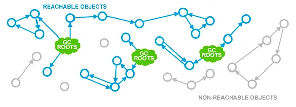
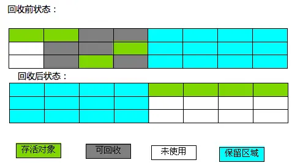
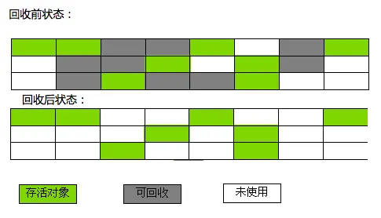
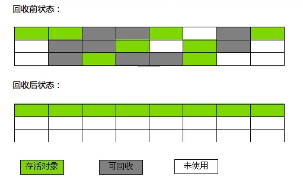
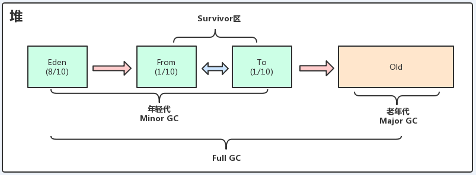

# JVM

## JVM

### 组成

* JVM memory / runtime data area
  * 线程私有：Program counter register (byte code where the thread executes and tells the address of the next exec instruction to execution engine), JVM stack, native method stack
  * 线程共享：heap, method area (类信息、常量、静态变量、JIT compiled code等)
* class loader: 加载字节码到内存中
* execution engine:&#x20;
  * Interpreter: execution of the byte code
  * JIT: optimize and translate hotspots (frequent bytecode) to machine code
* GC
* native method interface: 本地方法库的接口

### 作用

compiler -Java cod-> byte code -> class loader加载到内存中 -> execution engine跟native interface交互将byte code翻译为底层系统指令再交由CPU执行

### 类加载过程

按需加载，即在使用类之前才会加载。

1. 加载：通过类的全限定名（包名+类名）找到字节码文件然后读取到内存中
2. 验证：验证加载的字节码文件的正确性
3. 准备：为类的静态变量分配内存
4. 解析：将常量池中的符号引用（标识）替换为直接引用（指向内存中的地址）的过程
5. 初始化：对静态变量和静态代码块执行初始化工作

### 双亲委派

#### what

类加载器收到类加载请求后，首先判断当前类是否被加载过，已经被加载的类会直接返回，如果没有，首先将类加载请求转发给父类加载器，一直转发到顶层的启动类加载器，只有当父类加载器无法完成才尝试自己加载。

#### why

避免类的重复加载，保证了类的一致性。

### 创建对象的过程

* 类加载：如果该类没有被加载过，先执行类加载
* 分配内存
* 初始化：设初始化成员变量，执行构造函数等，把堆内对象的首地址赋值给引用变量

### heap vs. stack

| heap                         | stack                                              |
| ---------------------------- | -------------------------------------------------- |
| 数据存储，stores object instances | 方法执行，stores 局部变量、返回方法地址等                           |
| 不连续、不固定、更大，慢、运行期确认           | 连续、固定、快、编译器确认                                      |
|                              | 每个方法被调用直到执行完成的过程，就对应着一个stack frame在虚拟机栈中从入栈到出栈的过程。 |

### 对象内存分配如何保证线程安全？

* CAS (Compare and Swap, 3 operands: memory location & expected value & new value, like AtomicInteger)，效率低。
* 线程在堆中预分配内存，一般采用这种策略。


## GC

### 如何判断对象是否可被回收？

* 引用计数：存在循环引用的问题，一般不使用。
* 可达性分析：通过GC Roots作为起始节点，根据引用关系向下搜索，搜索不到就被标记为垃圾。常见的作为GCRoots的比如静态变量属于类而不是对象，生命周期与应用程序一致，保证了它们引用的对象不会被提前回收。

<figure><figcaption></figcaption></figure>

### 引用类型

* 强引用：不会被回收。一般用new创建。
* 软引用：只有在内存不够的情况下才会被回收。
* 弱引用：GC遇到即回收。
* 虚引用：无法通过该引用获取到对象。一般用于在对象回收前执行一些清理操作或跟踪回收情况。

### 垃圾回收算法

<figure><figcaption><p>copying 复制</p></figcaption></figure>

<figure><figcaption><p>tracing 标记清除</p></figcaption></figure>

<figure><figcaption><p>compacting 标记整理</p></figcaption></figure>

<figure><figcaption></figcaption></figure>

### 内存泄漏

长生命周期对象持有短生命周期对象的引用可能导致内存泄漏，常见场景如静态集合类、各种连接、单例模式等。

```
// 静态类生命周期与应用程序一样长，导致object对象不能被GC回收
Object o = new Object();
vector.add(object);
object = null;
```

