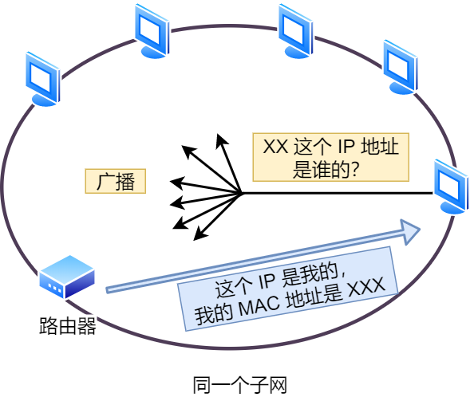
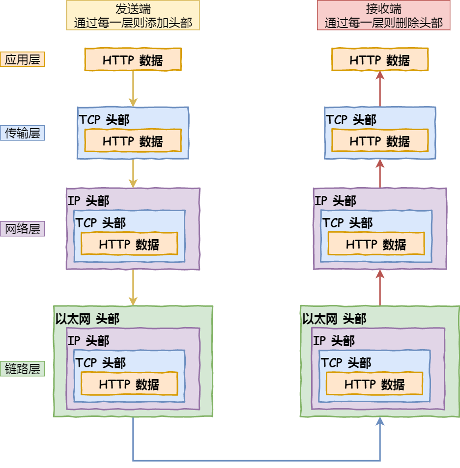

# Network

## 访问Web URL，发生了什么？

1. 域名解析：通过域名查找IP
2. TCP handshake + TLS handshake if required (非对称加密交换密钥+对称加密交换数据)
3. 发送HTTP请求
4. 服务器处理请求并返回结果
5. 断开连接

## why need 3-way handshake for TCP?

为了防止server端收到已经失效的连接请求报文段而建立连接后一直等待，浪费资源。

ARP协议查询2层MAC地址

<figure><figcaption></figcaption></figure>

网卡驱动控制网卡将网络包复制到网卡缓存区内并封装后，转为电信号通过网线发送出去。电信号到达网线接口后，交换机里的模块进行接受，将其从电信号转回数字信号。再转发到路由器，然后路由表查询转发目标，把以太网包发给下一个路由器，最后跳到相应端口的路由器。

<figure><figcaption>
网络报文封装
</figcaption></figure>

## RPC vs REST

|      | RPC                                                                                   | RESTful                                                                    |
| ---- | ------------------------------------------------------------------------------------- | -------------------------------------------------------------------------- |
| 优点   | 
- 高性能和效率

- 丰富的数据类型支持

- 明确的接口定义

- 强调服务调用

- 支持多种协议和传输方式
  | 
- 简单和易于理解

- 基于标准的HTTP协议

- 松散耦合的架构

- 可缓存和可伸缩
       |
| 缺点   | 
- 需要事先定义接口和数据结构

- 对编程语言和平台有依赖

- 较为复杂的部署和维护

- 不适用于浏览器和Web应用程序
 | 
- 缺乏标准化的接口定义

- 传输开销较大

- 不支持丰富的数据类型

- 不适合强调服务调用的场景
 |
| 适用场景 | 
- 分布式系统间的高性能通信

- 服务间的远程调用

- 复杂的业务逻辑和数据处理
                           | 
- Web应用程序的前后端通信

- 资源的增删改查操作

- 轻量级和简单的交互
                 |

### cookie & session

