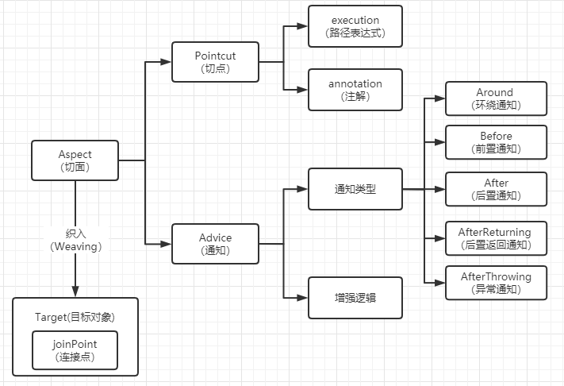

# Web

## Spring

### IoC

### AOP

<figure><figcaption></figcaption></figure>

### BeanFactory & ApplicationContext

| BeanFactory             | ApplicationContext                    |
| ----------------------- | ------------------------------------- |
| 最底层接口，IoC核心             | BeanFactory的子接口                       |
| 延迟加载，getBean才会发现可能的配置问题 | 容器启动时一次性创建所有bean，占用内存空间，启动较慢，运行时速度较快。 |
| 需要显式配置依赖关系              | @Autowaired自动装配                       |
| 不主动管理bean生命周期           | 主动管理                                  |

### Spring如何解决循环依赖

利用三级缓存提前暴露尚未完成依赖注入和初始化的Bean实例的引用，以便其他Bean可以使用。如果循环依赖链过长或存在无法解决的循环依赖，依然有抛出异常的可能。

