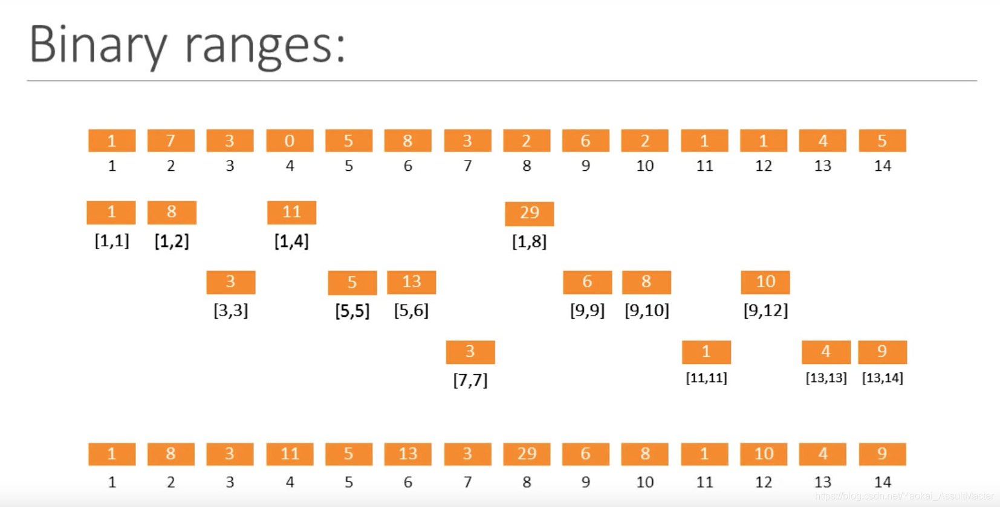

# \* binary indexed tree

Regarding to an array of size N, BIT supports updating value in certain index and getting prefix sum in log(N) time. BIT\[0] is set as empty. 根据数字的二进制表示来对数组中的元素进行逻辑上的分层存储。

<figure><figcaption></figcaption></figure>

<figure><figcaption><p>求前缀和=向上寻找母节点的过程</p></figcaption></figure>

## getPrefixSum(idx)

```
while idx > 0
 sum += BIT[idx]
 idx -= lowbit(idx)
```

## update(idx, val)

```
delta = val - A[idx]
while idx <= N
    BIT[idx] += delta
    idx += lowbit(idx)
```

## lowbit(x)

```
x & (-x)
// 13 = 2^3 + 2^2 + 2^0
// 1101 (x) -> 0010 -> 0011 -> 0001 (-x) -> 0001
// prefixSum(13) = bit[13] + bit[12] + bit[8]
```
