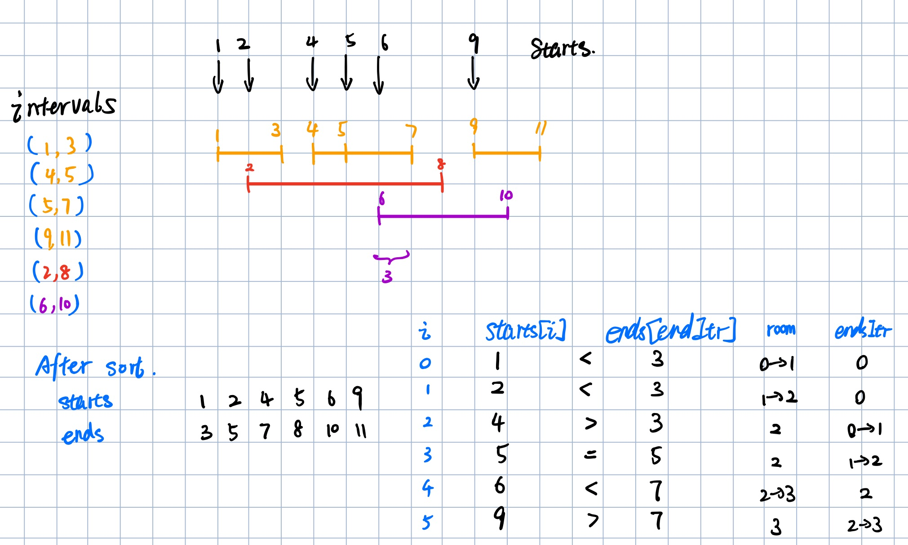

# 252/253. meeting room I && II

## I

Given an array of meeting time intervals consisting of start and end times `[[s1,e1],[s2,e2],...]` (si < ei), determine if a person could attend all meetings.

```
Example 1:
Input: [[0,30],[5,10],[15,20]]
Output: false
```

```
Example 2:
Input: [[7,10],[2,4]]
Output: true
```







```java
class Solution {
    public boolean canAttendMeetings(Interval[] intervals) {
        if (intervals == null || intervals.length <= 1) {
            return true;
        }
        
        Arrays.sort(intervals, new Comparator<Interval>() {
           @Override
            public int compare(Interval int1, Interval int2) {
                return int1.start - int2.start;
            }
        });
        
        Interval cur = intervals[0];
        for (int i = 1; i < intervals.length; i++) {
            if (cur.end > intervals[i].start) {
                return false;
            }
            
            cur.end = Math.max(cur.end, intervals[i].end);
        }
        
        return true;
    }
}
```



## II

Given an array of meeting time intervals consisting of start and end times `[[s1,e1],[s2,e2],...]` (si < ei), find the minimum number of conference rooms required.

```
Example:
Input: [[0, 30],[5, 10],[15, 20]]
Output: 2
```



* Sort starts and ends individually

When we encounter an ending event, that means that some meeting that started earlier has ended now. We are not really concerned with which meeting has ended. All we need is that **some** meeting ended thus making a room available.



* priority queue



```java
//sort starts and ends individually 
public int minMeetingRooms(Interval[] intervals) {
    if (intervals == null || intervals.length == 0) {
        return 0;
    }

    int[] starts = new int[intervals.length];
    int[] ends = new int[intervals.length];
    for (int i = 0; i < intervals.length; i++) {
        starts[i] = intervals[i].start;
        ends[i] = intervals[i].end;
    }

    Arrays.sort(starts);
    Arrays.sort(ends);

    int res = 0, endPointer = 0;
    for (int i = 0; i < intervals.length; i++) {
        if (starts[i] < ends[endPointer]) {
            res++;
        } else {
            endPointer++;
        }
    }

    return res;
}

//pq
public int minMeetingRooms(Interval[] intervals) {
    if (intervals == null || intervals.length == 0) {
        return 0;
    }

    Arrays.sort(intervals, new Comparator<Interval>() {
        @Override
        public int compare(Interval i, Interval j) {
            return i.start - j.start;
        }
    });

    Queue<Interval> pq = new PriorityQueue<>(new Comparator<Interval>() {
        @Override
        public int compare(Interval i, Interval j) {
            return i.end - j.end;
        }
    });
    pq.offer(intervals[0]);

    for (int i = 1; i < intervals.length; i++) {
        Interval room = pq.poll();

        if (intervals[i].start >= room.end) {
            room.end = intervals[i].end; //no extra room needed, just update the time for the room
        } else {
            pq.offer(intervals[i]);
        }

        pq.offer(room);
    }

    return pq.size();
}
```



